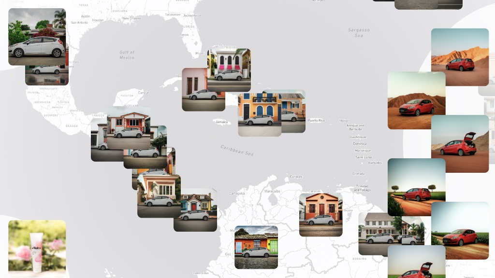

# Shape Shifter

Rapidly generate text ads and ad backgrounds for your product using **Google Ads** and **DV360** targeting.

[](https://google-marketing-solutions.github.io/shape_shifter/)

# About 

Shape Shifter showcases the ability to replace product backgrounds
accurately using Google AI.  It is useful for:

1. Replace advertising image backgrounds or text copy based on targeting such as:
  1. Geography or points of interest.
  2. Audience.
  3. Time of day.
  4. Device type.
  5. Or any other source of data.

There are two parts to this code:

1. **Demo** - Shows a cool globe of various products rendered with different backgrounds base don country.
1. **Workflow** - The logic that connects to **DV360** and/or **Google Ads** and generates ads from targeting.

# Demo

[View the demo here.](https://google-marketing-solutions.github.io/shape_shifter/) The coolest parts of the demo are:

1. The product images are integrated flawlessly.
1. The houses for the car background look like they're from that country.
1. The AI correctly picks up the fauna and tile patterns of each country.
1. The products are rendered correctly on shelves.
1. Every image is first pass AI generated, we did not edit it, imagine what you can do with more variety.

The process is designed to be an end to end demo of how to integrate an AI process into both products.

1. Process:
   1. A set of product images is used 
   1. A query is run to select 180+ largest countries around the world to accommodate markers on map.  
   1. The product images are cross joined with the countries to generate an **Imagen 2** prompt for each.  
   1. The AI generated images are saved using a naming convention to the local folder.  
   1. A script combines the LAT/LONG coordinates of each country and the generated images.  
   1. The index.html file contains a [MapBox globe](https://docs.mapbox.com/mapbox-gl-js/api/markers/) that renders everything.
1. A few things to know:  
   1. Vorato and Balm are completely independent. Click images on left to switch between them.  
   2. Left images always show "original" image used as input to AI.  
   3. Right images are 'ALL' the images generated for a country. Clicking one switch the map to use that image.  
   4. For Vorato there are : 2 farm images, 2 landscape images, 1 street image.  
   5. For Balm: there are: 1 counter image, 1 garden image, 1 flower/spa image  
   6. All images were processed 100% using AI, the prompt for each image is shown under the image in the map ( they are the same across countries).
1. Demo Page Instructions:  
   1. press **s**: controls spin on and off  
   2. press **r**: (party game) selects random place and show images ( ask users to guess location)  
   3. press **a**: (party game) travels to answer and shows country  

## Customize The Demo

Pitch your clients with a custom product demo, [here is the source](https://github.com/google-marketing-solutions/shape_shifter/tree/main/demo) and how:

```
python ../bqflow/run.py demo/vorato.json -u ~user.json -p gcp-project -v
python ../bqflow/run.py demo/cbalm.json -u ~user.json -p gcp-project -v
python demo/ads.py 
```

# Product Workflows

Generate ads from campaign targeting with minimal overhead.

## DV360

New display ads are created in drive for review, then uploaded to DV360.

### Generate Creatives

```
python ../bqflow/run.py dv360/targeting.json -u ~user.json -p gcp-project -v
python dv360/upload_assets.py 
```

## Google Ads

New text ads are created directly within Google Ads.  

```
python ../bqflow/run.py gads/targeting.json -u ~user.json -p gcp-project -v
python ../bqflow/run.py gads/upload_assets.json -u ~user.json -p gcp-project -v
```

# Requirements
1. [Google Cloud Project](https://cloud.google.com)
1. [Vertex AI API](https://console.cloud.google.com/marketplace/product/google/aiplatform.googleapis.com)
1. [BQFlow](https://github.com/google-marketing-solutions/bqflow)

# License

Copyright 2024 Google LLC

Licensed under the Apache License, Version 2.0 (the "License");
you may not use this file except in compliance with the License.
You may obtain a copy of the License at

    https://www.apache.org/licenses/LICENSE-2.0

Unless required by applicable law or agreed to in writing, software
distributed under the License is distributed on an "AS IS" BASIS,
WITHOUT WARRANTIES OR CONDITIONS OF ANY KIND, either express or implied.
See the License for the specific language governing permissions and
limitations under the License.

# Disclaimer

This is NOT an official Google product.
